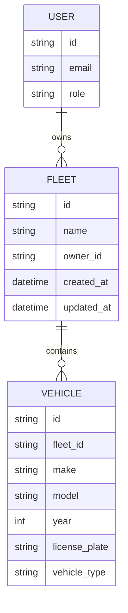

# Fleet-Vehicle Relationships & Integration Points

## Entity Relationship Diagram



## Integration Points

### 1. Fleet Management
- Fleet creation and assignment
- Vehicle addition/removal from fleet
- Fleet-level operations
- Fleet analytics

### 2. Vehicle Operations
- Individual vehicle management
- Fleet assignment
- Status tracking
- Maintenance scheduling

### 3. User Management
- Fleet ownership
- Access control
- Role-based permissions
- User-vehicle relationships

## Data Flow

### Fleet → Vehicle
1. **Assignment**
   - Vehicle added to fleet
   - Fleet ID updated
   - Status tracking initiated

2. **Operations**
   - Fleet-wide updates
   - Bulk operations
   - Status synchronization

### Vehicle → Fleet
1. **Status Updates**
   - Location tracking
   - Maintenance status
   - Operational status

2. **Analytics**
   - Usage statistics
   - Performance metrics
   - Cost tracking

## API Endpoints (Planned)

### Fleet Management
```
POST   /fleets
GET    /fleets
GET    /fleets/{id}
PUT    /fleets/{id}
DELETE /fleets/{id}
```

### Vehicle-Fleet Operations
```
POST   /fleets/{id}/vehicles
GET    /fleets/{id}/vehicles
DELETE /fleets/{id}/vehicles/{vehicle_id}
```

### Fleet Analytics
```
GET    /fleets/{id}/analytics
GET    /fleets/{id}/vehicles/status
GET    /fleets/{id}/maintenance
```

## Security Considerations

1. **Access Control**
   - Fleet owner permissions
   - Fleet manager roles
   - Vehicle operator access

2. **Data Isolation**
   - Fleet-level data separation
   - Cross-fleet restrictions
   - User data privacy

## Performance Considerations

1. **Caching Strategy**
   - Fleet metadata
   - Vehicle status
   - User permissions

2. **Query Optimization**
   - Fleet-vehicle joins
   - Status aggregation
   - Analytics queries

## Next Steps

1. **Design Phase**
   - Detailed API specifications
   - Database schema updates
   - Migration planning

2. **Implementation**
   - Fleet service foundation
   - Vehicle service updates
   - Integration testing

3. **Testing**
   - Unit tests
   - Integration tests
   - Performance tests 