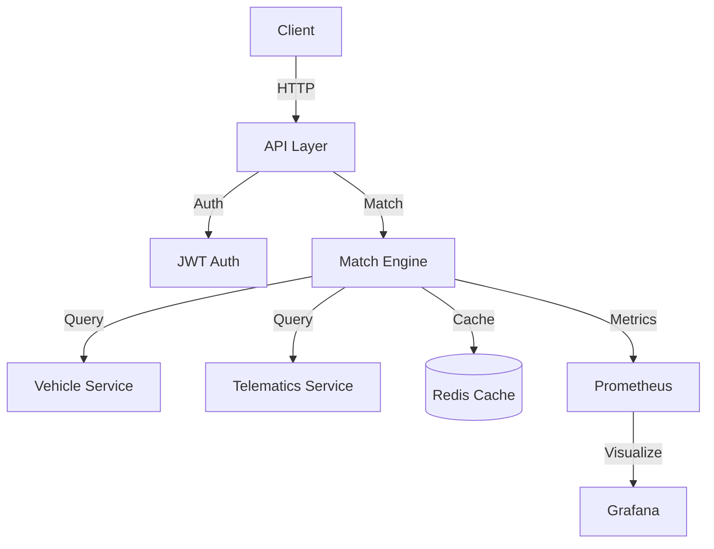

# Load Matching Service Architecture

## System Overview

The Load Matching Service is a critical component of the TAMP system, responsible for matching available trucks with load requests based on various criteria including location, capacity, and special requirements.

## Architecture Diagram



## Components

### 1. API Layer
- FastAPI-based REST API
- JWT authentication
- Rate limiting
- Request validation
- Response formatting

### 2. Match Engine
- Multi-factor scoring algorithm
- Distance calculation
- Capacity matching
- Special requirements handling
- Cost estimation

### 3. External Services
- Vehicle Service: Vehicle metadata and availability
- Telematics Service: Real-time location and status

### 4. Caching Layer
- Redis for vehicle data caching
- Match result caching
- Rate limit tracking

### 5. Monitoring
- Prometheus metrics
- Grafana dashboards
- Health checks
- Performance monitoring

## Data Flow

1. **Request Processing**
   ```
   Client Request
   → JWT Validation
   → Rate Limit Check
   → Request Validation
   → Match Engine
   ```

2. **Matching Process**
   ```
   Match Request
   → Vehicle Data Fetch/Cache
   → Distance Calculation
   → Score Calculation
   → Result Sorting
   → Response
   ```

3. **Caching Strategy**
   ```
   Vehicle Data
   → Cache Check
   → Cache Miss → Vehicle Service
   → Cache Update
   → Return Data
   ```

## Security

1. **Authentication**
   - JWT-based authentication
   - Token validation
   - Role-based access control

2. **Rate Limiting**
   - Per-client rate limits
   - Burst handling
   - Rate limit headers

3. **Data Protection**
   - Input validation
   - Output sanitization
   - Error handling

## Scalability

1. **Horizontal Scaling**
   - Stateless design
   - Load balancing ready
   - Container orchestration support

2. **Performance Optimization**
   - Caching strategy
   - Connection pooling
   - Async processing

3. **High Availability**
   - Health checks
   - Circuit breakers
   - Retry mechanisms

## Monitoring

1. **Metrics**
   - Request latency
   - Success rate
   - Cache hit rate
   - Error rate

2. **Logging**
   - Structured logging
   - Error tracking
   - Audit logging

3. **Alerts**
   - Performance degradation
   - Error rate spikes
   - Service unavailability

## Future Enhancements

1. **AI Integration**
   - Machine learning for match scoring
   - Predictive analytics
   - Pattern recognition

2. **Advanced Features**
   - Real-time matching
   - Dynamic pricing
   - Route optimization

3. **Integration**
   - Additional service integrations
   - Third-party APIs
   - Mobile app support 