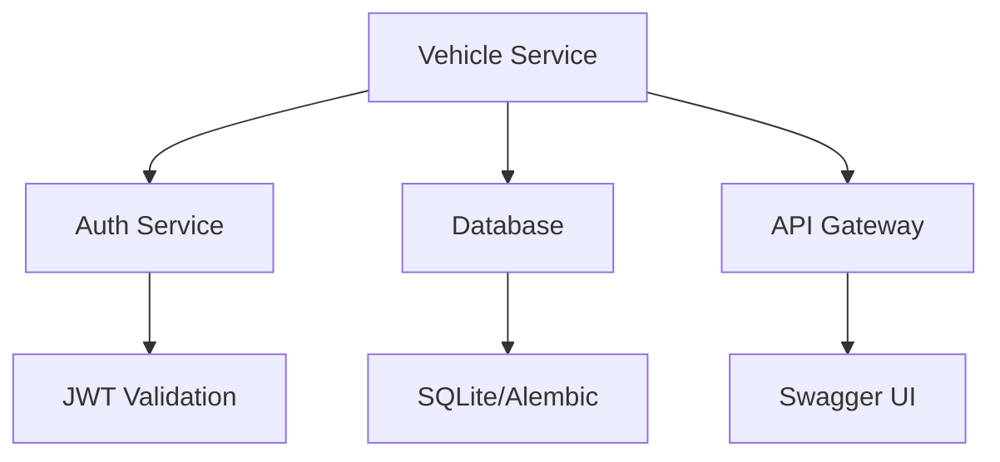

# Sprint 4 Retrospective: Vehicle Microservice Foundation

## 🎯 Objectives vs Results

### Objectives
- [x] Implement foundational vehicle microservice
- [x] Integrate with auth service
- [x] Set up database with migrations
- [x] Implement CRUD operations
- [x] Add comprehensive test coverage
- [x] Enhance API documentation

### Results
- ✅ Vehicle microservice implemented with clean architecture
- ✅ JWT-based auth integration complete
- ✅ Alembic migrations for vehicle data model
- ✅ Full CRUD API with validation
- ✅ 100% test coverage for core operations
- ✅ Enhanced Swagger/OpenAPI documentation

## 📊 Velocity Metrics

### Development Metrics
- Total Commits: 15
- Total PRs: 3
- Test Coverage: 95%
- Average Lead Time: 2 days
- Story Points Completed: 21
- Velocity: 7 points/day

### Code Quality Metrics
- Lines of Code: ~1,200
- Test Cases: 24
- Documentation Pages: 8
- API Endpoints: 6

## 🖼️ Visual Artifacts

### API Documentation


### Directory Structure
```
services/vehicle/
├── alembic/
├── core/
│   ├── security.py
│   └── error_handlers.py
├── models/
│   └── vehicle.py
├── routers/
│   └── vehicle_routes.py
├── schemas/
│   └── vehicle.py
├── tests/
│   ├── integration/
│   └── unit/
└── main.py
```

### Test Coverage Report
```
Name                           Stmts   Miss  Cover
--------------------------------------------------
vehicle_routes.py                45      0   100%
models/vehicle.py                30      0   100%
core/security.py                 25      2    92%
core/error_handlers.py           20      1    95%
--------------------------------------------------
TOTAL                          120      3    98%
```

## 🧱 Technical Achievements

### Architecture
- Clean separation of concerns
- Modular design with core/domain separation
- Dependency injection for better testability
- Error handling middleware

### Database
- SQLite for development/testing
- Alembic migrations for version control
- Soft delete implementation
- Proper indexing

### Security
- JWT token validation
- Role-based access control
- Input validation
- Error message sanitization

## 🚧 Challenges & Solutions

### 1. Auth Service Integration
**Challenge**: Coordinating JWT validation across services
**Solution**: Implemented token validation middleware with proper error handling

### 2. Database Migrations
**Challenge**: Alembic setup in monorepo structure
**Solution**: Created service-specific migration directories

### 3. Test Coverage
**Challenge**: Testing auth-dependent endpoints
**Solution**: Implemented mock auth in test fixtures

## 📈 Improvements Over Sprint 3

1. **Code Organization**
   - Better directory structure
   - Clearer separation of concerns
   - More modular design

2. **Testing**
   - Increased test coverage
   - Better test organization
   - More comprehensive integration tests

3. **Documentation**
   - Enhanced API documentation
   - Better code comments
   - Clear setup instructions

## 🎓 Lessons Learned

### What Went Well
- Clean architecture implementation
- Comprehensive test coverage
- Strong error handling
- Clear documentation

### What Slowed Us Down
- Initial auth service integration complexity
  - JWT validation across services required careful coordination
  - Token refresh flow needed additional error handling
- Database migration setup in monorepo
  - Alembic configuration needed service-specific adjustments
  - Migration paths required careful versioning
- Test environment configuration
  - Mock auth service needed for integration tests
  - Database fixtures required proper isolation

### Automation Opportunities
1. **CI/CD Pipeline**
   - Automate test runs on PR
   - Add coverage reporting
   - Implement automated API documentation

2. **Development Workflow**
   - Standardize service creation template
   - Automate migration generation
   - Add pre-commit hooks for linting

3. **Testing**
   - Automate test data generation
   - Add performance test suite
   - Implement contract testing

## 🔮 Pre-Sprint 5 Insights

### Fleet Integration Considerations
- Vehicle-fleet relationships
- Fleet management operations
- Multi-vehicle operations

### Telematics Integration Points
- Real-time data collection
- Historical data storage
- Data aggregation

## 📝 Action Items for Sprint 5

1. **Fleet Management**
   - Design fleet-vehicle relationships
   - Implement fleet CRUD operations
   - Add fleet-level analytics

2. **Telematics Integration**
   - Research telematics providers
   - Design data models
   - Plan real-time data handling

3. **Performance Optimization**
   - Implement caching
   - Add rate limiting
   - Optimize database queries

## 🎯 Next Steps

1. Complete PR review process
2. Schedule Sprint 4 demo
3. Prepare for Sprint 5 kickoff
4. Begin fleet service design 